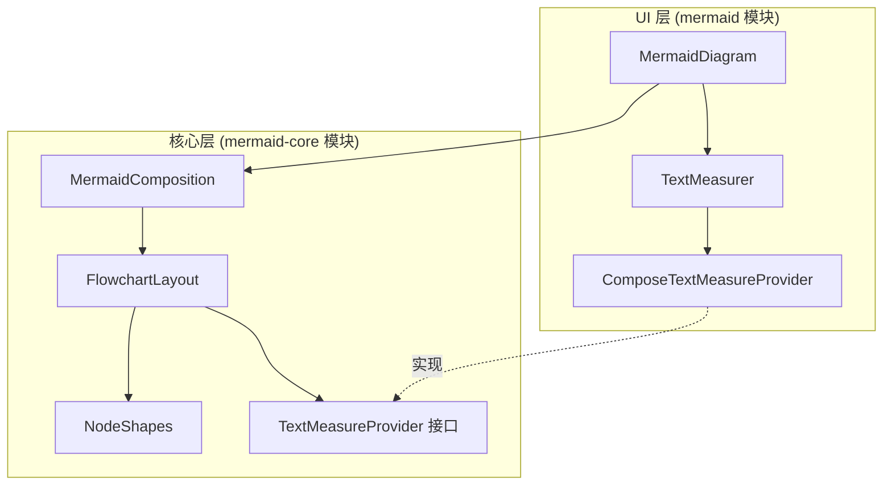

## 用户需求

优化 Kotlin Multiplatform Mermaid 渲染库的 flowchart 节点样式，解决文本内容超出节点框的问题。

## 产品概述

这是一个支持安卓、iOS、Desktop 和 Web 的 Kotlin Multiplatform Mermaid 图表解析与渲染库。当前 flowchart 的节点尺寸计算采用固定字符宽度估算（charWidth=10f），导致不同字符（中文、英文、特殊字符）的实际渲染宽度无法准确测量，文本可能溢出节点边框。

## 核心功能

1. **精确文本测量**：在布局阶段使用 Compose TextMeasurer 精确测量文本尺寸，替代当前的字符数估算方式
2. **节点尺寸自适应**：根据实际测量的文本尺寸，为所有形状（矩形、菱形、圆形、六边形等）计算合适的节点大小
3. **参考 mermaid-js 样式**：按照 mermaid-js 的形状特定尺寸计算逻辑优化各形状的绘制效果

## 技术栈

- 框架：Kotlin Multiplatform（commonMain）
- UI 层：Compose Multiplatform
- 文本测量：androidx.compose.ui.text.TextMeasurer
- 布局算法：自定义分层布局引擎

## 实现方案

### 核心思路

将 Compose 的 TextMeasurer 从渲染阶段提前到布局阶段，创建一个跨平台的文本测量接口，使布局引擎能够获取精确的文本尺寸。布局时先测量文本，再根据测量结果和形状特性计算节点框的最终尺寸。

### 关键技术决策

1. **文本测量接口抽象**

- 创建 `TextMeasureProvider` 接口，定义 `measureText(text: String, fontSize: Float): TextSize` 方法
- 在 Composable 层使用 Compose TextMeasurer 实现该接口
- 布局阶段通过该接口获取精确的文本尺寸，避免布局与渲染之间的耦合

2. **布局流程改造**

- `MermaidComposition.parse()` 方法增加可选的 `TextMeasureProvider` 参数
- `FlowchartLayout.layout()` 方法增加 `TextMeasureProvider` 参数
- 在 Composable 层创建 `ComposeTextMeasureProvider` 实例，传递给布局引擎

3. **形状特定尺寸计算（参考 mermaid-js）**

- **矩形/圆角矩形/体育场形**：`width = textWidth + paddingX*2`，`height = textHeight + paddingY*2`
- **菱形（Diamond）**：`size = textWidth + textHeight + padding*2`（mermaid-js 的 question.ts 逻辑）
- **六边形（Hexagon）**：`width = textWidth + 2*m`，其中 `m = height/4`（斜边水平投影）
- **圆形（Circle）**：`diameter = max(textWidth, textHeight) + padding*2`
- **平行四边形**：`width = textWidth + slant + padding*2`（考虑斜边偏移）
- **梯形**：`width = textWidth + inset*2 + padding*2`

### 性能考虑

- TextMeasurer 的 measure 方法会创建 TextLayoutResult，是相对昂贵的操作
- 文本测量只在布局阶段执行一次，不会影响每帧渲染性能
- 布局结果缓存在 DiagramData 中，重复渲染无需重新计算

## 实现细节

### 文本测量提供者接口

在布局阶段注入文本测量能力，保持 mermaid-core 模块的平台无关性。

### 布局阶段改造

1. `FlowchartLayouter` 的 `calculateNodeSizes()` 方法使用注入的 TextMeasureProvider
2. 如果未提供 TextMeasureProvider，回退到现有的字符估算方式（向后兼容）
3. 每种形状根据 mermaid-js 的计算逻辑调整尺寸

### Composable 层集成

1. `MermaidDiagram` Composable 中使用 `rememberTextMeasurer()` 创建测量器
2. 将测量器包装为 `ComposeTextMeasureProvider`
3. 在 `rememberMermaidComposition` 中传递给布局引擎

## 架构设计



### 数据流

1. `MermaidDiagram` 创建 `TextMeasurer` 并包装为 `ComposeTextMeasureProvider`
2. 调用 `MermaidComposition.parse(text, provider)` 解析并布局
3. `FlowchartLayout` 使用 provider 测量每个节点的文本
4. 根据测量结果和形状类型计算节点尺寸
5. 执行后续的位置计算和边路由

## 目录结构

```
mermaid-core/src/commonMain/kotlin/io/github/lugf027/mermaid/
├── layout/
│   ├── LayoutEngine.kt          # [MODIFY] 新增 TextMeasureProvider 接口定义
│   │                            # - 添加 TextMeasureProvider 接口
│   │                            # - 修改 TextMeasurer.measure() 支持使用 provider
│   │                            # - 保留原有字符估算作为回退方案
│   │
│   └── flowchart/
│       └── FlowchartLayout.kt   # [MODIFY] 使用 TextMeasureProvider 精确测量
│                                # - FlowchartLayouter 增加 textMeasureProvider 参数
│                                # - calculateNodeSizes() 使用精确测量
│                                # - 按形状类型实现 mermaid-js 尺寸计算逻辑
│
├── MermaidComposition.kt        # [MODIFY] parse() 方法支持传入 TextMeasureProvider
│                                # - 新增接受 TextMeasureProvider 的重载方法
│                                # - 传递 provider 给 FlowchartLayout

mermaid/src/commonMain/kotlin/io/github/lugf027/mermaid/
├── MermaidDiagram.kt            # [MODIFY] 创建 ComposeTextMeasureProvider
│                                # - 使用 rememberTextMeasurer 创建测量器
│                                # - 实现 ComposeTextMeasureProvider 类
│                                # - 在布局前调用带 provider 的 parse 方法
│
└── rememberMermaidComposition.kt # [MODIFY] 支持传入 TextMeasureProvider
                                 # - MermaidCompositionSpec 支持 provider
                                 # - StringSpec.load() 使用 provider
```

## 关键代码结构

```
// LayoutEngine.kt - 文本测量接口
public interface TextMeasureProvider {
    /**
     * 测量文本尺寸
     * @param text 要测量的文本
     * @param fontSize 字体大小
     * @return 文本的宽度和高度
     */
    fun measureText(text: String, fontSize: Float): TextSize
}

// FlowchartLayout.kt - 形状尺寸计算（参考 mermaid-js）
internal fun calculateNodeSize(
    textSize: TextSize,
    shape: NodeShape,
    config: LayoutConfig
): Pair<Float, Float> {
    val paddingX = config.textPadding
    val paddingY = config.textPadding
    
    return when (shape) {
        NodeShape.DIAMOND -> {
            // mermaid-js: size = width + height + padding
            val size = textSize.width + textSize.height + paddingX * 2
            size to size
        }
        NodeShape.HEXAGON -> {
            // mermaid-js: 额外宽度 = height/4 (斜边投影)
            val m = textSize.height / 4
            (textSize.width + m * 2 + paddingX * 2) to (textSize.height + paddingY * 2)
        }
        NodeShape.CIRCLE, NodeShape.DOUBLE_CIRCLE -> {
            val diameter = maxOf(textSize.width, textSize.height) + paddingX * 2
            diameter to diameter
        }
        // ... 其他形状
    }
}
```

## Agent Extensions

### SubAgent

- **code-explorer**
- Purpose: 在实现过程中如需查找 mermaid-js 的更多参考实现细节，使用该工具进行跨文件搜索
- Expected outcome: 获取 mermaid-js 中各形状的精确尺寸计算公式和边距参数