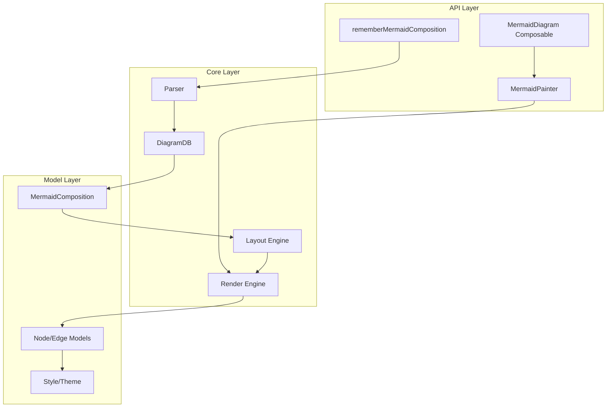

## 用户需求

创建一个 Kotlin 跨平台 (KMP) 的 Mermaid 图表渲染库，支持 Android、iOS、Desktop 和 Web 目标平台。

## 产品概述

KMP Mermaid 是一个纯 Kotlin/Compose Multiplatform 实现的 Mermaid 图表渲染库，允许开发者在跨平台应用中渲染各种 Mermaid 图表（如流程图、时序图、思维导图等），采用类似 Compottie (Lottie 动画库) 的模块化架构设计。

## 核心功能

1. **Mermaid 语法解析器**：解析 Mermaid DSL 文本，构建图表数据结构
2. **多图表类型支持**：

- Flowchart（流程图）- 首期实现
- Sequence Diagram（时序图）
- Mindmap（思维导图）
- Class Diagram（类图）
- State Diagram（状态图）

3. **Compose 原生渲染**：使用 Compose Canvas/Graphics API 进行图表绘制
4. **跨平台支持**：Android、iOS (arm64/simulatorArm64)、Desktop (JVM)、Web (JS/WasmJS)
5. **声明式 API**：提供 `rememberMermaidComposition`、`MermaidDiagram` 等 Composable 函数
6. **主题定制**：支持自定义图表样式、颜色、字体等

## Tech Stack

### 核心技术栈

- **语言**：Kotlin 2.3.0
- **UI 框架**：Compose Multiplatform 1.10.0
- **协程**：Kotlinx Coroutines 1.10.2
- **序列化**：Kotlinx Serialization（用于配置和缓存）
- **构建工具**：Gradle 8.x + Kotlin DSL
- **目标平台**：Android、iOS (arm64/simulatorArm64)、JVM Desktop、JS、WasmJS

### 依赖库

- `compose.foundation`：基础绘图 API
- `compose.ui`：Canvas 绘图
- `compose.runtime`：Composable 状态管理
- `kotlinx-serialization-json`：JSON 解析
- `androidx-collection`：高效集合类

## Implementation Approach

### 整体策略

采用 **分层架构** + **模块化设计**，参考 Compottie 项目结构：

1. **Core 模块**：包含解析器、数据模型、布局算法、渲染引擎的核心实现
2. **主模块**：提供完整的 Composable API
3. **Example 模块**：示例应用，展示各种图表类型

### 关键技术决策

1. **解析器设计**：采用手写递归下降解析器而非 JISON/ANTLR

- 原因：Kotlin Multiplatform 无法直接使用 JS/JVM 特定的解析器生成工具
- 方案：参考 Mermaid.js 语法规则，实现纯 Kotlin 解析器

2. **布局算法**：自实现简化版 Dagre 布局

- 原因：现有 Dagre 库为 JS 实现，需要 Kotlin 移植
- 方案：首期实现简单层次布局，后续迭代增强

3. **渲染引擎**：基于 Compose Canvas API

- 使用 `DrawScope` 绘制节点、边、文本
- 支持自定义 Painter 实现复杂图形

4. **数据流设计**：

```
Mermaid Text → Parser → DiagramData → Layout → RenderTree → Canvas Draw
```

### 性能考量

- 解析结果缓存，避免重复解析
- 使用 `remember` 缓存布局计算结果
- 大型图表支持增量渲染
- 时间复杂度：解析 O(n)，布局 O(n log n)，渲染 O(n)

## Implementation Notes

### 复用模式

- 参考 Compottie 的 `LottieComposition` 设计 `MermaidComposition`
- 参考 Compottie 的 `rememberLottieComposition` 设计 `rememberMermaidComposition`
- 复用现有项目的 Gradle 配置和平台层次结构

### 关键注意事项

- 首期仅实现 Flowchart 图表类型，确保核心架构稳定
- 解析器需要处理 Mermaid 语法的各种边界情况
- Canvas 绘制需要考虑不同平台的字体渲染差异
- 使用 `expect/actual` 处理平台特定的文本测量

## Architecture Design

### 系统架构图



### 模块划分

| 模块 | 职责 | 主要类/接口 |
| --- | --- | --- |
| `mermaid-core` | 核心解析、布局、渲染 | `MermaidParser`, `DiagramData`, `LayoutEngine`, `RenderEngine` |
| `mermaid` | Composable API | `MermaidDiagram`, `rememberMermaidComposition`, `MermaidPainter` |
| `example` | 示例应用 | 各平台入口和演示代码 |


### 数据流

```
用户调用 MermaidDiagram(text) 
  → rememberMermaidComposition 触发解析
  → MermaidParser.parse(text) 生成 DiagramData
  → LayoutEngine.layout(data) 计算节点位置
  → MermaidPainter.paint(layoutResult) 绘制到 Canvas
```

## Directory Structure

项目采用多模块结构，参考 Compottie 的组织方式：

```
kmp_mermaid/
├── build.gradle.kts                    # [MODIFY] 根构建配置，添加子模块通用配置
├── settings.gradle.kts                 # [MODIFY] 添加新模块声明
├── gradle/
│   └── libs.versions.toml              # [MODIFY] 添加 serialization 等依赖版本
├── mermaid-core/                       # [NEW] 核心模块
│   ├── build.gradle.kts                # 核心模块构建配置，配置多平台目标和依赖
│   └── src/
│       ├── commonMain/kotlin/io/github/lugf027/mermaid/
│       │   ├── Mermaid.kt              # 全局配置和工具类（日志、调度器）
│       │   ├── MermaidComposition.kt   # 图表组合数据，包含解析结果和元数据
│       │   ├── MermaidCompositionSpec.kt # 图表加载规范，支持字符串和资源
│       │   ├── MermaidException.kt     # 异常定义
│       │   ├── parser/
│       │   │   ├── MermaidParser.kt    # 解析器入口，根据图表类型分发
│       │   │   ├── Tokenizer.kt        # 词法分析器，将文本转为 Token 流
│       │   │   └── flowchart/
│       │   │       ├── FlowchartParser.kt   # 流程图语法解析器
│       │   │       └── FlowchartDetector.kt # 流程图类型检测器
│       │   ├── model/
│       │   │   ├── DiagramType.kt      # 图表类型枚举
│       │   │   ├── DiagramData.kt      # 图表数据基类
│       │   │   ├── Node.kt             # 节点数据模型
│       │   │   ├── Edge.kt             # 边数据模型
│       │   │   └── flowchart/
│       │   │       ├── FlowchartData.kt    # 流程图数据，包含顶点、边、子图
│       │   │       ├── FlowVertex.kt       # 流程图顶点
│       │   │       └── FlowEdge.kt         # 流程图边
│       │   ├── layout/
│       │   │   ├── LayoutEngine.kt     # 布局引擎接口
│       │   │   ├── LayoutResult.kt     # 布局结果，包含节点位置和尺寸
│       │   │   └── flowchart/
│       │   │       └── FlowchartLayout.kt  # 流程图层次布局算法
│       │   ├── render/
│       │   │   ├── RenderEngine.kt     # 渲染引擎接口
│       │   │   ├── DrawContext.kt      # 绘制上下文
│       │   │   ├── shapes/
│       │   │   │   ├── NodeShapes.kt   # 节点形状绘制（矩形、圆形、菱形等）
│       │   │   │   └── EdgeShapes.kt   # 边形状绘制（箭头、线条）
│       │   │   └── flowchart/
│       │   │       └── FlowchartRenderer.kt # 流程图渲染器
│       │   └── theme/
│       │       ├── MermaidTheme.kt     # 主题定义接口
│       │       └── DefaultTheme.kt     # 默认主题配置
│       ├── androidMain/kotlin/         # Android 平台特定实现（字体测量等）
│       ├── iosMain/kotlin/             # iOS 平台特定实现
│       ├── jvmMain/kotlin/             # Desktop 平台特定实现
│       └── webMain/kotlin/             # JS/WasmJS 平台特定实现
├── mermaid/                            # [NEW] 主模块（Composable API）
│   ├── build.gradle.kts                # 主模块构建配置
│   └── src/
│       └── commonMain/kotlin/io/github/lugf027/mermaid/
│           ├── MermaidDiagram.kt       # MermaidDiagram Composable，主要入口组件
│           ├── MermaidPainter.kt       # Painter 实现，封装绘制逻辑
│           ├── rememberMermaidComposition.kt # 组合记忆函数，管理解析和缓存
│           └── MermaidState.kt         # 状态管理，处理交互和动画
└── example/                            # [NEW] 示例应用
    ├── shared/                         # 共享示例代码
    │   └── src/commonMain/kotlin/
    │       └── io/github/lugf027/mermaid/example/
    │           ├── SampleDiagrams.kt   # 示例图表定义
    │           └── DiagramShowcase.kt  # 图表展示组件
    ├── androidApp/                     # Android 示例应用
    ├── desktopApp/                     # Desktop 示例应用
    └── webApp/                         # Web 示例应用
```

## Key Code Structures

### 核心接口定义

```
// MermaidComposition.kt - 图表组合数据
@Stable
public class MermaidComposition internal constructor(
    internal val diagramData: DiagramData,
    internal val diagramType: DiagramType,
) {
    public companion object {
        public fun parse(text: String): MermaidComposition
    }
    
    public val width: Float
    public val height: Float
}

// DiagramData.kt - 图表数据基类
public sealed interface DiagramData {
    val nodes: List<Node>
    val edges: List<Edge>
    val direction: Direction
}

// LayoutEngine.kt - 布局引擎接口
public interface LayoutEngine {
    suspend fun layout(data: DiagramData, constraints: Constraints): LayoutResult
}

// RenderEngine.kt - 渲染引擎接口  
public interface RenderEngine {
    fun DrawScope.render(layoutResult: LayoutResult, theme: MermaidTheme)
}
```

### Composable API 设计

```
// MermaidDiagram.kt - 主要 Composable 入口
@Composable
public fun MermaidDiagram(
    composition: MermaidComposition?,
    modifier: Modifier = Modifier,
    theme: MermaidTheme = MermaidTheme.Default,
    contentDescription: String? = null,
)

// rememberMermaidComposition.kt - 组合记忆函数
@Composable
public fun rememberMermaidComposition(
    vararg keys: Any?,
    spec: suspend () -> MermaidCompositionSpec,
): MermaidCompositionResult
```

## Agent Extensions

### SubAgent

- **code-explorer**
- Purpose: 在实现过程中探索参考项目 Compottie 和 Mermaid.js 的具体实现细节
- Expected outcome: 获取准确的 API 设计模式、数据结构定义和渲染逻辑参考