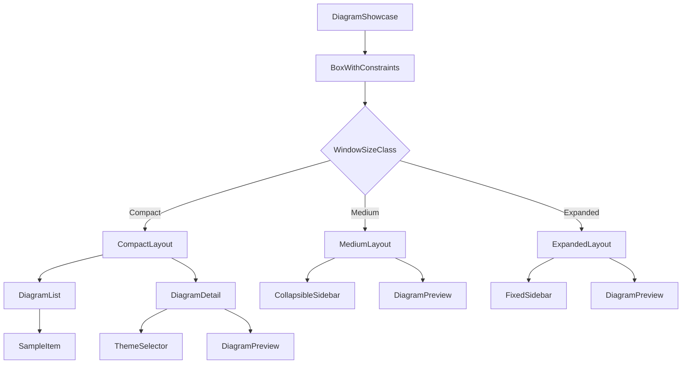

## 产品概述

重新实现 Kotlin Multiplatform Mermaid 渲染库的 Demo 界面，解决当前界面没有响应式适配的问题，使其在移动端（Android/iOS）、桌面端（Desktop）、Web端都能提供良好的交互体验。

## 核心功能

1. **响应式布局系统**：根据窗口宽度自动切换布局模式

- 紧凑模式（<600dp）：移动端竖屏，采用"列表 - 详情页"导航
- 中等模式（600-900dp）：平板/中等窗口，采用可折叠侧边栏
- 扩展模式（>900dp）：桌面端宽屏，采用固定双栏布局

2. **移动端适配**

- 首屏展示图表列表，点击进入详情页查看源码和渲染结果
- 顶部导航栏支持返回按钮
- 主题选择器自适应换行或折叠为下拉菜单

3. **平板/中等窗口适配**

- 可折叠的侧边栏，默认展开
- 支持点击按钮收起/展开侧边栏

4. **桌面端适配**

- 保持当前双栏布局，优化比例分配
- 侧边栏宽度根据窗口动态调整

5. **交互优化**

- 平滑的页面切换动画
- 主题选择器在窄屏时自适应布局

## 技术栈

- **语言**: Kotlin
- **框架**: Compose Multiplatform 1.10.0
- **UI组件**: Material3
- **目标平台**: Android、iOS、Desktop (JVM)、Web (JS/WasmJS)

## 实现方案

### 核心策略

使用 Compose 的 `BoxWithConstraints` 组件检测可用宽度，结合自定义的 `WindowSizeClass` 枚举实现响应式布局断点判断。通过组合不同的布局组件实现三种模式的自适应切换。

### 关键技术决策

1. **选择 BoxWithConstraints 而非 expect/actual**：BoxWithConstraints 是纯 Compose API，无需平台特定实现，代码更简洁，维护成本更低。所有平台行为一致。

2. **采用单文件重构而非多文件拆分**：当前 Demo 代码量不大（约270行），保持单文件结构可以减少导入复杂度，同时通过清晰的函数划分保持可读性。

3. **移动端采用状态驱动的伪导航**：使用 `selectedIndex` 状态控制列表/详情视图切换，配合 AnimatedContent 实现过渡动画，避免引入额外的导航库依赖。

### 响应式断点设计

```
紧凑模式 (Compact):   width < 600dp  -> 单列列表/详情切换
中等模式 (Medium):    600dp <= width < 900dp -> 可折叠侧边栏
扩展模式 (Expanded):  width >= 900dp -> 固定双栏布局
```

## 实现要点

### 性能考量

- `BoxWithConstraints` 仅在顶层使用一次，避免嵌套导致的重复测量
- 列表使用 `LazyColumn` 保证大数据量时的性能
- 动画使用 `AnimatedContent` / `AnimatedVisibility`，由 Compose 优化渲染

### 代码设计

- 遵循现有代码风格：public 函数使用 `public` 修饰符，私有组件使用 `private`
- 保持与现有 `MermaidDiagram`、`rememberMermaidComposition` API 的兼容
- 主题选择器复用 Material3 的 `FilterChip` 和 `FlowRow` 组件

### 向后兼容

- 不修改现有的 `SampleDiagrams.kt` 数据文件
- 不修改各平台入口文件（MainActivity.kt、Main.kt 等）
- 保持 `DiagramShowcase()` 作为唯一对外入口

## 架构设计

### 组件层次结构



### 数据流

```
用户操作 -> 状态更新 (selectedIndex/currentTheme/sidebarExpanded)
         -> 组件重组 -> UI 更新
```

## 目录结构

```
example/shared/src/commonMain/kotlin/io/github/lugf027/mermaid/example/
├── DiagramShowcase.kt  # [MODIFY] 主界面组件，重构为响应式布局
│                       # - 新增 WindowSizeClass 枚举定义布局断点
│                       # - 新增 calculateWindowSizeClass() 函数
│                       # - 新增 CompactLayout 组件（移动端列表/详情切换）
│                       # - 新增 MediumLayout 组件（可折叠侧边栏）
│                       # - 新增 ExpandedLayout 组件（固定双栏）
│                       # - 重构 ThemeSelector 支持 FlowRow 自适应换行
│                       # - 保留并优化 SampleItem、DiagramPreview 组件
└── SampleDiagrams.kt   # [不修改] 示例数据，保持不变
```

## 关键代码结构

### WindowSizeClass 断点定义

```
private enum class WindowSizeClass {
    Compact,   // < 600dp: 移动端竖屏
    Medium,    // 600-900dp: 平板/中等窗口
    Expanded   // >= 900dp: 桌面端
}

private fun calculateWindowSizeClass(widthDp: Dp): WindowSizeClass = when {
    widthDp < 600.dp -> WindowSizeClass.Compact
    widthDp < 900.dp -> WindowSizeClass.Medium
    else -> WindowSizeClass.Expanded
}
```

### 响应式主入口

```
@Composable
public fun DiagramShowcase() {
    BoxWithConstraints(modifier = Modifier.fillMaxSize()) {
        val windowSizeClass = calculateWindowSizeClass(maxWidth)
        // ... 状态定义
        
        when (windowSizeClass) {
            WindowSizeClass.Compact -> CompactLayout(...)
            WindowSizeClass.Medium -> MediumLayout(...)
            WindowSizeClass.Expanded -> ExpandedLayout(...)
        }
    }
}
```